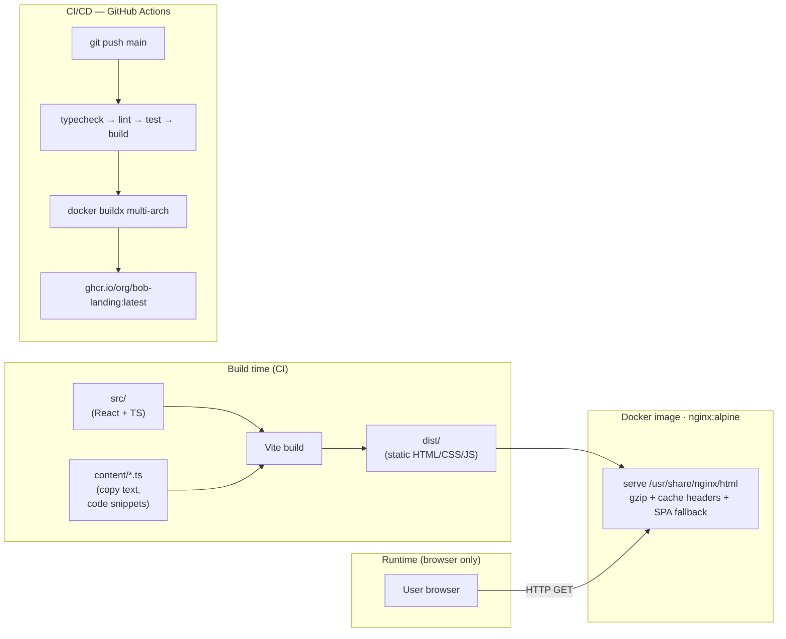

# SPEC-PLAN: IBM Bob — SDLC Capabilities Showcase Landing Page

| | |
|---|---|
| **Version** | 2.0 |
| **Owner** | Partner IBM tại Việt Nam |
| **Audience** | Head of Software Engineering / IT Director, banking VN (primary). CIO (secondary). |
| **Status** | Implemented — Sprint 1–4 done |
| **Effort estimate** | ~7 ngày dev (1 fullstack mid-senior) |
| **Last updated** | 2026-04-27 |

---

## 1. Overview

Landing page tiếng Việt 1-trang showcase technical capabilities của **IBM Bob** (AI SDLC Partner, hiện ở preview stage) cho thị trường ngân hàng Việt Nam. Page dùng **một use case nano duy nhất xuyên suốt** — *Loan Portfolio Risk Dashboard* viết bằng Python/Streamlit — để minh họa cụ thể vai trò của Bob trong từng bước SDLC: từ Spec → Plan → Code → Review → Test → Deploy.

**Mục tiêu duy nhất: educate market.** Giúp Head of Engineering banking VN hiểu cụ thể Bob khác coding assistant thông thường (Copilot, Cursor) ở điểm nào — qua 5 Modes tích hợp, tính năng Auto-Approve, Skills (.bob/), MCP integration, và multi-model orchestration.

> **Quyết định v2.0**: Không có CTA / lead-gen / contact form. Page hoàn toàn là kênh educate — không thu thập thông tin người dùng.

---

## 2. Architecture Decisions

Mỗi quyết định bên dưới có format: **Chosen** / **Alternatives considered** / **Rationale**.

### 2.1 Use case demo: "Loan Portfolio Risk Dashboard"
- **Chosen**: Python script + Streamlit dashboard tính NPL ratio từ CSV `loan_portfolio.csv`, breakdown theo product/branch.
- **Alternatives**: (a) generic "todo app" — bị loại vì không banking-relevant; (b) eKYC API integration — quá lớn cho 1 demo nano; (c) fraud rule engine refactor — đụng compliance phức tạp; (d) reconciliation dashboard — relevant nhưng kém "wow" hơn NPL.
- **Rationale**: NPL ratio là KPI sống còn của banking VN, mọi Head of Eng đều hiểu. Đủ nhỏ (~10 file, 200–400 LOC) để Bob demo end-to-end SDLC mà không loãng. Tech stack Python+Streamlit phổ biến với DA team trong banking. Synthetic data → an toàn cho demo public.

### 2.2 Frontend stack: Vite + React + TypeScript
- **Chosen**: Vite 5, React 18, TypeScript strict, Tailwind CSS 3, `@carbon/react`, Framer Motion, Shiki, Mermaid.js.
- **Alternatives**: Next.js (bị loại — dư SSR/API routes cho static page); Astro (Carbon React integration phức tạp hơn); Vanilla HTML+JS (khó scale interactive stepper).
- **Rationale**: Vite build static SPA siêu nhanh, deploy qua nginx đơn giản. Carbon React official cho IBM design language. Tailwind cho custom layout ngoài Carbon. 7 main deps — ít, thông dụng.

### 2.3 Design language: IBM Carbon (with creative latitude)
- **Chosen**: Carbon làm xương sống (color tokens, typography, grid, components), custom layer phía trên cho hero, SDLC stepper, MCP diagram.
- **Alternatives**: Material UI / Chakra (không match brand IBM); pure custom (mất enterprise feel, mất uy tín với banking audience).
- **Rationale**: Banking VN audience quen visual enterprise, nhận diện được IBM aesthetic = thêm uy tín. Carbon đủ flexible để thêm motion, gradient, asymmetry mà không phá vỡ identity.

### 2.4 Demo interaction model: mocked walkthrough (KHÔNG gọi Bob API thật)
- **Chosen**: Tất cả Bob output (spec, code, review findings) là **pre-authored content** lưu trong `/content`, render qua component. Stepper điều khiển hiển thị.
- **Alternatives**: Tích hợp Bob API thật (bị loại — Bob đang preview, API không công khai stable, rate limit, latency không predictable cho landing page).
- **Rationale**: Predictable UX, không phụ thuộc network/API status, demo luôn chạy được. Trade-off: không phải "live demo" thật — bù lại bằng disclaimer rõ "đây là walkthrough".

### 2.5 Content separation: copy text tách khỏi component code
- **Chosen**: Tất cả copy text + code snippets demo nằm trong `/src/content/*.ts`, component chỉ import và render.
- **Alternatives**: Inline string trong JSX; headless CMS (Contentful, Sanity).
- **Rationale**: Non-dev (marketing, partner team) edit copy được mà không động vào component. Headless CMS over-engineering cho 1 landing page tiếng Việt phase 1.

### 2.6 Deployment: Docker + GitHub Actions
- **Chosen**: Multi-stage Dockerfile (node build → nginx alpine serve), docker-compose, GitHub Actions push image lên GHCR.
- **Alternatives**: Vercel/Netlify (bị loại — banking VN audience nhạy cảm với foreign hosting; partner có thể muốn deploy on-prem); pure static hosting.
- **Rationale**: Image nhỏ (<50MB), portable, partner có thể deploy bất cứ đâu (VPS, on-prem, AWS).

### 2.7 Không có form / lead-gen
- **Chosen**: Bỏ hoàn toàn contact form, CTA section, và mọi third-party form endpoint.
- **Rationale**: Page thuần educate — không thu thập data người dùng → không cần consent banner, không phụ thuộc Formspree / CRM, kiến trúc đơn giản hơn, không có surface attack từ form submission.

---

## 3. System Architecture

Static SPA — không có backend, không có external API call. Hoàn toàn offline-capable sau khi load.



**Key flows:**
1. **Build**: source + content → Vite build → static files → baked vào nginx Docker image.
2. **Runtime**: browser load static SPA. Không có network call nào ngoài Google Fonts (load IBM Plex từ CDN). Mọi interaction (stepper, toggle) là client-side state.
3. **CI/CD**: push main → typecheck + lint + test → build → Docker push GHCR. Deploy = pull image trên server.

---

## 4. Module Breakdown

### 4.1 `src/components/layout/`
- **Purpose**: Layout chrome (header, footer) xuất hiện trên mọi section.
- **Depends on**: `@carbon/react`, `@carbon/icons-react`, `hooks/useScrollSpy`.
- **Exposes**: `<Header />` (sticky nav + scroll-spy + mobile menu), `<Footer />` (IBM sources, disclaimer).

### 4.2 `src/components/sections/`
- **Purpose**: Mỗi file = 1 section (10 section, scroll order 01→10). File đánh số khớp scroll order.
- **Depends on**: `components/ui/*`, `content/*`, Carbon, Framer Motion.
- **Exposes**: 1 default-exported component mỗi file.

### 4.3 `src/components/ui/` — reusable primitives
- **Purpose**: Shared UI building blocks, prop-driven, không biết về business logic.
- **Components**:
  - `CodeBlock.tsx` — Shiki syntax highlight + copy button
  - `StepCard.tsx` — Card cho 1 SDLC step trong stepper
  - `ArtifactViewer.tsx` — Tabs viewer (content + highlights) + Auto-Approve confirmation UI
  - `ModeChip.tsx` — Carbon Tag màu theo mode key
  - `ApprovalToggle.tsx` — Carbon Toggle Auto-Approve Off ↔ On + inline notification
  - `MermaidDiagram.tsx` — Render Mermaid string → SVG (lazy init)

### 4.4 `src/content/`
- **Purpose**: Single source of truth cho mọi copy text và demo data. Non-dev có thể edit file `.ts` này mà không cần hiểu component.
- **Files**: `sdlc-steps.ts`, `bob-modes.ts`, `code-snippets.ts`, `pain-points.ts`, `stats.ts`, `use-case.ts`, `translations.ts`

### 4.5 `src/hooks/`
- **Purpose**: React hooks thuần — stateful UI logic tách khỏi component, có thể unit test độc lập.
- **Exposes**: `useScrollSpy(sectionIds)` → active section ID, `useStepperState(stepIds)` → stepper state + actions.

### 4.6 `src/lib/`
- **Purpose**: Pure utilities, shared types, constants. Không import từ React hay bất kỳ UI lib.
- **Files**: `types.ts`, `constants.ts` (IBM URLs, nav sections), `analytics.ts` (optional Plausible wrapper).

### 4.7 `tests/`
- **Purpose**: Unit tests (Vitest) cho hooks + smoke E2E (Playwright).
- **Coverage target**: `hooks/` ≥ 70%, smoke test: load + scroll + stepper navigate.

---

## 5. Folder & File Structure

```
bob-sdlc-landing/
├── .github/
│   └── workflows/
│       └── deploy.yml               # CI: typecheck → lint → test → build → Docker → GHCR
├── docker/
│   ├── Dockerfile                   # Multi-stage: node:20-alpine build → nginx:1.27-alpine serve
│   └── nginx.conf                   # SPA fallback + gzip + cache headers + security headers
├── public/
│   ├── favicon.ico
│   └── og-image.png                 # OpenGraph preview
├── src/
│   ├── main.tsx                     # React entry, mount App
│   ├── App.tsx                      # Root: Header + 10 sections + Footer
│   │
│   ├── components/
│   │   ├── layout/
│   │   │   ├── Header.tsx           # Sticky top nav, logo, scroll-spy active, mobile menu
│   │   │   └── Footer.tsx           # IBM sources citation, disclaimer
│   │   │
│   │   ├── sections/
│   │   │   ├── 01-Hero.tsx          # Headline + 2 CTA (scroll-to-demo, scroll-to-roi) + animated bg
│   │   │   ├── 02-Problem.tsx       # 4 pain card banking SDLC
│   │   │   ├── 03-MeetBob.tsx       # Bob là gì + 4 differentiator + stat cards
│   │   │   ├── 04-UseCaseIntro.tsx  # Loan NPL Dashboard: persona, schema, tech stack
│   │   │   ├── 05-SDLCStepper.tsx   # ⭐ CORE: 9-step interactive walkthrough
│   │   │   ├── 06-Modes.tsx         # 5 mode selector + detail panel
│   │   │   ├── 07-Approval.tsx      # Manual ↔ Autonomous toggle + workflow diagram
│   │   │   ├── 08-MCP.tsx           # Integration topology (Mermaid) + integration list
│   │   │   ├── 09-Security.tsx      # Compliance features + badge grid + disclaimer
│   │   │   └── 10-ROI.tsx           # 4 stat card + time-saving table
│   │   │
│   │   └── ui/
│   │       ├── CodeBlock.tsx        # Shiki highlight + copy button
│   │       ├── StepCard.tsx         # SDLC step card (active/completed/idle state)
│   │       ├── ArtifactViewer.tsx   # Tabs: content + highlights; approval gate UI
│   │       ├── ModeChip.tsx         # Carbon Tag pill per mode key
│   │       ├── ApprovalToggle.tsx   # Toggle + animated inline notification
│   │       └── MermaidDiagram.tsx   # Lazy Mermaid SVG renderer
│   │
│   ├── content/
│   │   ├── sdlc-steps.ts            # 9 step objects: title, mode, prompt, artifact, phase
│   │   ├── bob-modes.ts             # 5 mode defs + customModeExamples
│   │   ├── code-snippets.ts         # All demo code strings (SPEC.md, risk_calc.py, tests...)
│   │   ├── pain-points.ts           # 4 banking pain points
│   │   ├── stats.ts                 # IBM stats với sourceUrl
│   │   ├── use-case.ts              # Persona, schema, tech stack, NPL formula
│   │   └── translations.ts          # Placeholder i18n
│   │
│   ├── styles/
│   │   ├── global.scss              # @use '@carbon/react' + import tailwind + overrides
│   │   ├── carbon-overrides.scss    # Surgical Carbon overrides
│   │   └── tailwind.css             # @tailwind base/components/utilities + custom layers
│   │
│   ├── hooks/
│   │   ├── useScrollSpy.ts          # IntersectionObserver → active section ID
│   │   └── useStepperState.ts       # useReducer stepper: select, expand, next/prev, approvalMode
│   │
│   └── lib/
│       ├── types.ts                 # SDLCStep, Artifact, BobMode, StepperState, StepperAction, ...
│       ├── constants.ts             # IBM_SOURCES, NAV_SECTIONS, SECTION_IDS, ANALYTICS_ID
│       └── analytics.ts             # trackEvent, trackStepperInteraction (Plausible stub)
│
├── tests/
│   ├── setup.ts                     # jest-dom + ResizeObserver polyfill cho jsdom
│   ├── unit/
│   │   └── useStepperState.test.ts  # 10 test cases: init, select, next/prev, edge cases
│   └── e2e/
│       └── landing.spec.ts          # Playwright: load, scroll, stepper click, footer links
│
├── docker-compose.yml               # 1-command production build local: port 8080
├── playwright.config.ts             # E2E config: baseURL localhost:5173, chromium
├── vitest.config.ts                 # Unit test config: jsdom, include tests/unit/**
├── tailwind.config.ts               # Carbon color tokens → Tailwind, IBM Plex fonts
├── vite.config.ts                   # Aliases (@, @content, @components, @hooks, @lib)
├── tsconfig.json / tsconfig.app.json / tsconfig.node.json
├── eslint.config.js                 # ESLint v9 flat config
├── prettier.config.js
├── package.json
├── index.html                       # HTML entry, IBM Plex preconnect, OG tags
├── README.md                        # Quickstart, commands, env vars, structure
├── DEPLOYMENT.md                    # Docker deploy, GHCR pull, nginx notes
├── .env.example                     # VITE_ANALYTICS_ID only
├── .gitignore
├── .nvmrc                           # 20
└── .editorconfig
```

---

## 6. Key Interfaces & Data Contracts

### 6.1 SDLC Step (`src/lib/types.ts`)

```typescript
export type SDLCPhase = 'plan' | 'build' | 'verify' | 'ship';
export type ArtifactType = 'code' | 'spec' | 'diagram' | 'review-findings' | 'test' | 'docs' | 'config';
// 5 built-in modes per official docs + custom
export type BobModeKey = 'ask' | 'plan' | 'code' | 'advanced' | 'orchestrator' | 'custom';

export interface Artifact {
  type: ArtifactType;
  filename: string;
  content: string;
  language?: string;
  highlights?: CodeHighlight[];
}

export interface SDLCStep {
  id: string;
  order: number;                       // 1–9
  phase: SDLCPhase;
  title: string;
  shortDesc: string;
  bobMode: BobMode;
  userPrompt: string;
  artifact: Artifact;
  approvalGate: boolean;
  durationEstimate: string;            // "~2 phút với Bob · ~2 ngày thủ công"
}
```

### 6.2 Bob Mode (`src/lib/types.ts`)

```typescript
export interface BobMode {
  key: BobModeKey;
  displayName: string;
  icon: string;
  shortDesc: string;
  whenToUse: string;
  examplePrompt?: string;
  isCustom?: boolean;
}
```

### 6.3 Stepper state (`src/hooks/useStepperState.ts`)

```typescript
export interface StepperState {
  activeStepId: string;
  expandedStepId: string | null;
  approvalMode: 'manual' | 'autonomous';
  autoPlay: boolean;
}

export type StepperAction =
  | { type: 'select'; stepId: string }
  | { type: 'toggleExpand'; stepId: string }
  | { type: 'setApprovalMode'; mode: 'manual' | 'autonomous' }
  | { type: 'next' }
  | { type: 'prev' }
  | { type: 'reset' };
```

---

## 7. Page Sections — Information Architecture

10 sections (CTA/lead-gen section đã loại bỏ ở v2.0).

| # | Section | Heading (VI) | Mục đích | Key components |
|---|---------|--------------|----------|----------------|
| 01 | Hero | "Bob — AI SDLC Partner cho ngân hàng Việt Nam" | Hook, position Bob, stats bar | Animated gradient bg, 2 scroll CTAs |
| 02 | Problem | "Phát triển phần mềm trong ngân hàng — những bottleneck quen thuộc" | Resonate với pain | 4 pain card |
| 03 | Meet Bob | "Bob là gì?" | Intro + 4 differentiator + stat cards | IBM stat grid (45%, 10K+, 9 bước, 4+ models) |
| 04 | Use Case Intro | "Use case demo: Loan Portfolio Risk Dashboard" | Set context cho stepper | Persona, schema, tech stack, disclaimer |
| 05 | **SDLC Stepper** ⭐ | "Bob trong từng bước SDLC" | CORE — 9 step walkthrough | StepCard list + ArtifactViewer + ApprovalToggle |
| 06 | Modes | "Modes — chọn vai trò phù hợp cho từng task" | Show flexibility | 5 built-in mode selector (Code/Ask/Plan/Advanced/Orchestrator) + Custom Mode |
| 07 | Auto-Approve | "Bạn kiểm soát mức độ tự động" | Address compliance concern | Auto-Approve toggle (Off=default/On) + workflow diagram + action risk table |
| 08 | MCP | "Bob không bị giới hạn trong IDE" | Show extensibility | MermaidDiagram topology + integration list |
| 09 | Security | "Built for enterprise — đặc biệt cho banking" | Address banking compliance | Feature list + compliance grid + disclaimer |
| 10 | ROI | "Số liệu thực tế từ IBM" | Business case | 4 stat card + time-saving table |

### 7.1 Use Case × SDLC × Bob — 9 step (Section 05)

| # | Phase | Bob Mode | User Prompt (mock) | Artifact |
|---|-------|----------|---------------------|----------|
| 1 | Plan | Plan Mode + Skill: Spec Architect | "Tôi cần dashboard Python theo dõi NPL ratio..." | `SPEC.md` |
| 2 | Plan | Plan Mode | "Đề xuất kiến trúc đơn giản nhất" | `ARCHITECTURE.md` + Mermaid |
| 3 | Build | Code Mode *(Bob xin xác nhận — Auto-Approve: Tắt)* | "Tạo file structure" | File tree — hiện confirmation prompt |
| 4 | Build | Code Mode *(Bob xin xác nhận — Auto-Approve: Tắt)* | "Viết function tính NPL ratio" | `risk_calc.py` |
| 5 | Verify | Advanced Mode | "Review toàn bộ diff trước PR — tìm bug, security issue" | Review findings (3 issue: HIGH/MEDIUM/LOW) |
| 6 | Verify | Advanced Mode + Skill: Test Generator | "Generate test cho risk_calc" | `test_risk_calc.py` (6 case) |
| 7 | Verify | Advanced Mode + Skill: Docs Architect | "Tạo README + ARCHITECTURE + API doc" | `README.md` |
| 8 | Ship | Code Mode + GitHub MCP *(Auto-Approve: Tắt)* | "Đóng gói Docker và setup CI" | `deploy.yml` |
| 9 | Ship | Orchestrator Mode | "Migrate sang FastAPI nếu cần?" | `MIGRATION_PLAN.md` |

---

## 8. Design System & Visual Guidelines

### 8.1 Color tokens (Carbon → Tailwind mapping)

```
--color-primary:        #0F62FE  (Blue 60)   — CTAs, links, active state
--color-primary-hover:  #0353E9  (Blue 70)
--color-text-primary:   #161616  (Gray 100)
--color-text-secondary: #525252  (Gray 70)
--color-bg-default:     #FFFFFF
--color-bg-section:     #F4F4F4  (Gray 10)   — alternate sections
--color-bg-dark:        #161616  (Gray 100)  — Hero, Security
--color-accent-teal:    #08BDBA  (Teal 40)   — Act/teal mode chip
--color-accent-yellow:  #F1C21B  (Yellow 30) — approval gate warning
--color-success:        #24A148  (Green 50)
--color-danger:         #DA1E28  (Red 60)
```

### 8.2 Typography
- **Display**: IBM Plex Sans, 600, 48–72px (Hero), 36–48px (section heading)
- **Body**: IBM Plex Sans, 400, 16–18px, line-height 1.5
- **Code**: IBM Plex Mono, 14px, line-height 1.6
- **Caption**: IBM Plex Sans, 400, 14px, color secondary

### 8.3 Layout
- **Grid**: Carbon 16-column, `max-w-content` = 1312px
- **Section vertical padding**: 96px desktop / 64px mobile (`section-padding` utility)
- **Container horizontal padding**: 24px mobile, 48px desktop (`section-container` utility)

### 8.4 Design rules
- ✅ Carbon component cho UI Shell, Button, Tag, Tile, Toggle, Tabs, InlineNotification
- ✅ Custom: animated SDLC stepper, gradient mesh hero, Mermaid MCP diagram, hover scale/shadow
- ✅ Subtle grain texture overlay trên dark sections
- ❌ KHÔNG glassmorphism, neon, purple gradient, cartoon, emoji nhiều
- ❌ KHÔNG generic font (Inter, Roboto) — IBM Plex Sans/Mono duy nhất

### 8.5 Motion (Framer Motion)
- Page load: stagger fade+slideUp per section (delay 0.1s, offset 20px)
- SDLC stepper: panel expand 0.3s cubic-bezier(0.16, 1, 0.3, 1)
- Hover card: `whileHover={{ scale: 1.005 }}` + shadow lift
- `prefers-reduced-motion` respected via Tailwind CSS global rule

### 8.6 Responsive breakpoints (Carbon)
```
sm:  320px   single column, stepper stacks vertically
md:  672px   2-col grid available
lg:  1056px  full layout — stepper 2:3 split, 3-col mode cards
xl:  1312px  max content width
```

---

## 9. Content Outline — samples

### Hero (section 01)
> # Bob — AI SDLC Partner cho ngân hàng Việt Nam
> Spec → Plan → Code → Review → Test → Deploy.
> Một AI agent đảm nhận nhiều vai trò. Bạn kiểm soát mọi quyết định.
>
> **[Xem Bob trong action ↓]** · **[Xem số liệu ROI]**

### SDLC Step 1 — Spec & Plan
> **Mode**: Plan Mode + Custom *Spec Architect*
>
> **Bạn nói với Bob:**
> > "Tôi cần dashboard Python theo dõi tỷ lệ NPL của portfolio cho vay, breakdown theo sản phẩm và chi nhánh. Data từ file CSV."
>
> **Bob trả về `SPEC.md`:**
> ```markdown
> # Loan Portfolio Risk Dashboard
> ## Functional requirements
> - Load loan_portfolio.csv với schema X
> - Tính NPL ratio = Σoutstanding[NPL3,4,5] / Σoutstanding
> ## Acceptance criteria ...
> ```
> *Plan Mode KHÔNG động đến code — chỉ generate spec để bạn review trước.*

### Security section (disclaimer bắt buộc)
> ⚠️ **Disclaimer**: Bob hiện ở giai đoạn preview. Phrasing "thiết kế hỗ trợ tuân thủ" KHÔNG đồng nghĩa "đã được chứng nhận". Liên hệ IBM Partner VN để biết lộ trình deploy on-premises.

---

## 10. Deployment

### 10.1 Local development
```bash
nvm use                    # Node 20 LTS (xem .nvmrc)
npm install
npm run dev                # http://localhost:5173
```

### 10.2 Các lệnh dev thường dùng
```bash
npm run dev          # Vite dev server với HMR
npm run build        # Production build → dist/
npm run preview      # Preview dist/ locally
npm run typecheck    # tsc --noEmit
npm run lint         # ESLint (0 warning mode)
npm run format       # Prettier
npm run test         # Vitest unit tests
npm run test:e2e     # Playwright E2E (cần dev server đang chạy)
npm run test:coverage  # Vitest + coverage report
```

### 10.3 Docker (production build, run local)
```bash
docker compose up --build  # http://localhost:8080
```

### 10.4 Dockerfile (multi-stage)
```dockerfile
# Stage 1: build
FROM node:20-alpine AS builder
WORKDIR /app
COPY package*.json ./
RUN npm ci
COPY . .
RUN npm run build

# Stage 2: serve
FROM nginx:1.27-alpine
COPY --from=builder /app/dist /usr/share/nginx/html
COPY docker/nginx.conf /etc/nginx/conf.d/default.conf
EXPOSE 80
HEALTHCHECK --interval=30s --timeout=3s \
  CMD wget -q --spider http://localhost/ || exit 1
CMD ["nginx", "-g", "daemon off;"]
```

### 10.5 GitHub Actions CI/CD
- **Trigger**: push `main`, release tag `v*`
- **Jobs**:
  1. `test`: typecheck → lint → `vitest run`
  2. `build-push` (cần `test` pass): `vite build` → `docker buildx` multi-arch (amd64 + arm64) → push GHCR → verify image size ≤ 50MB

### 10.6 Image size target
- Final image **< 50MB** (nginx alpine ~20MB + dist ~10MB)
- Verify: `docker images --format "{{.Size}}"`

### 10.7 Environment variables
Chỉ 1 biến env (optional):
```bash
VITE_ANALYTICS_ID=   # Plausible / GA4 — để trống = no tracking
```
Copy từ `.env.example`. Không có form endpoint vì không có lead-gen form.

---

## 11. Acceptance Criteria (Definition of Done)

### Functional
- [x] 10 sections render đầy đủ, đúng nội dung outline
- [x] SDLC Stepper: 9 step click được, mỗi step show artifact (code/spec/diagram)
- [x] Approval toggle Manual ↔ Autonomous animate đúng, inline notification đổi
- [x] Code snippet có syntax highlight (Shiki), nút copy hoạt động
- [x] Smooth scroll giữa section, header scroll-spy update active
- [x] Header mobile menu hoạt động (breakpoint < lg)

### Visual
- [x] Tuân thủ Carbon color tokens, IBM Plex typography
- [x] Responsive section heading: 28px mobile → 36px desktop (`text-heading-3 md:text-heading-2`)
- [x] Mode chip, badge, button dùng Carbon component
- [x] Scroll-triggered `whileInView` animations trên tất cả 10 sections
- [x] Dark sections (Hero, Security) có grain overlay
- [x] `prefers-reduced-motion` được respect

### Performance
- [ ] Lighthouse Performance ≥ 90 mobile *(cần verify)*
- [ ] FCP < 1.5s, LCP < 2.5s *(cần verify)*
- [x] Main index chunk 23KB gzipped (Shiki + Mermaid tách thành lazy chunks riêng)
- [x] IBM Plex font preloaded non-blocking (onload swap pattern)

### Technical
- [x] TypeScript strict mode, 0 `any`, 0 error
- [x] ESLint + Prettier pass, 0 warning
- [x] Vitest `useStepperState` — 10 tests pass
- [ ] Vitest coverage ≥ 70% cho `hooks/` *(backlog)*
- [ ] Playwright E2E smoke pass *(backlog — cần dev server)*
- [ ] Docker image < 50MB *(backlog verify)*
- [x] `docker-compose.yml` viết đúng, cấu trúc sẵn sàng build

### Content
- [x] 100% tiếng Việt (technical term giữ nguyên: Mode, MCP, SDLC, NPL...)
- [x] Tất cả số liệu IBM có cite source (URL ở footer và stat card)
- [x] Disclaimer "Bob đang ở preview" tại Security section
- [x] Không claim quá đáng ("thiết kế hỗ trợ tuân thủ", không "đã được chứng nhận")

---

## 12. Implementation Roadmap

### Sprint 1 — Foundation ✅ Done
- [x] Init Vite + React + TS, ESLint, Prettier, Vitest
- [x] Tailwind + `@carbon/react`, color token mapping
- [x] File structure theo spec
- [x] Header (sticky, scroll-spy, mobile menu) + Footer (IBM sources, disclaimer)
- [x] Sections 01 Hero, 02 Problem, 03 MeetBob
- [x] Dockerfile + docker-compose

### Sprint 2 — Core demo ✅ Done
- [x] Section 05 SDLC Stepper (9 step, vertical layout)
- [x] `useStepperState` hook (10 unit tests pass)
- [x] `ArtifactViewer`, `CodeBlock` (Shiki), `ModeChip`, `StepCard`, `ApprovalToggle`
- [x] Content `sdlc-steps.ts` — 9 step đầy đủ artifact
- [x] Section 04 Use Case Intro

### Sprint 3 — Showcase sections ✅ Done
- [x] Section 06 Modes (5 mode selector + detail panel)
- [x] Section 07 Approval toggle + workflow diagram
- [x] Section 08 MCP với Mermaid diagram + integration list
- [x] Section 09 Security & Compliance (feature list + badge grid + disclaimer)
- [x] Section 10 ROI (stat card + time-saving table)
- [x] `MermaidDiagram` component

### Sprint 4 — Polish & ship ✅ Done
- [x] Framer Motion animation: `whileInView` stagger trên tất cả 10 sections, hover states (translateY, scale)
- [x] Scroll offset fix: `scroll-margin-top: 56px` cho tất cả section[id] — nav link không còn bị che bởi sticky header
- [x] Responsive headings: `section-heading` scale từ 28px (mobile) → 36px (md+)
- [x] Mobile stepper UX: click step tự scroll xuống artifact viewer trên màn hình nhỏ (< 1024px)
- [x] Bundle split: Shiki + Mermaid vào `manualChunks` riêng — index giảm từ 214KB → 23KB gzipped
- [x] IBM Plex font preload non-blocking (onload swap pattern trong index.html)
- [ ] Playwright E2E smoke test *(backlog — cần dev server)*
- [ ] Docker image size verify *(backlog)*
- [ ] GitHub Actions deploy test *(backlog)*

---

## 13. Open Questions

Cần partner team confirm trước Sprint 4:

1. **Domain triển khai**: subdomain partner (`bob.partnername.vn`) hay domain riêng? — ảnh hưởng SSL, OG image absolute URL.
2. **Logo & branding**: có file SVG Bob logo, IBM partner badge chính thức chưa? — hiện dùng placeholder text "B".
3. **Analytics**: track bằng Plausible self-hosted, GA4, hay không track? — ảnh hưởng `VITE_ANALYTICS_ID`.
4. **Disclaimer wording**: cần legal review trước khi public không? — đặc biệt phần compliance.
5. **Content review cycle**: ai final-approve copy tiếng Việt?
6. **Hosting target**: VPS Việt Nam (Viettel IDC, FPT Cloud), AWS Singapore, hay on-prem partner? — ảnh hưởng GHA deploy step.

---

## 14. Out of Scope (phase 1)

- Lead-gen form / contact form / bất kỳ thu thập thông tin KH nào
- English version / multi-language i18n
- Live chat / chatbot widget
- Blog / case study / news section
- User authentication / personalized dashboard
- Real Bob API integration — phase 1 toàn bộ là mocked walkthrough
- A/B testing infrastructure
- Headless CMS
- SEO advanced (schema.org structured data) — phase 1 chỉ basic OG tags

---

## 15. Bob Official Capabilities Reference

Dữ liệu từ docs chính thức — https://bob.ibm.com/docs/ide/features/

### 15.1 Modes (5 built-in)

| Mode | Mô tả | Tool access |
|------|-------|-------------|
| **Code** | Viết, sửa, refactor code — default cho implementation | Read, Write, Execute, MCP |
| **Ask** | Hỏi-đáp, research — không thay đổi file | Read, Browser, MCP |
| **Plan** | Thiết kế, spec — chỉ edit markdown | Read, Markdown write only |
| **Advanced** | Full access mọi tool — bắt buộc khi dùng Skills | All tools |
| **Orchestrator** | Điều phối multi-step — tự chuyển mode phù hợp | Delegates to sub-modes |
| **Custom** | Persona team tự định nghĩa — tool access configurable | Configurable |

Chuyển mode: dropdown cạnh chat input, slash command (`/code`, `/ask`, `/plan`, `/advanced`, `/orchestrator`), hoặc `⌘+.`

### 15.2 Auto-Approve (bob.ibm.com/docs/ide/features/auto-approving-actions)

- **Mặc định**: Bob luôn hỏi trước khi thực thi mỗi action
- **Auto-Approve setting**: hover toolbar phía trên chat input → chọn action nào được tự động thực thi
- **Granularity**: có thể bật/tắt từng loại: Read, Write, Execute, Browser, MCP, Skills, Retry, Mode, Subtasks, Question, Todo
- **Execute safeguards**: LLM risk detection + AST-based command validation (chặn `&&`, `||`, `;`, `|`)
- **IBM warning**: "Auto-approve settings bypass confirmation prompts... can result in data loss, file corruption, or worse"
- **Recommendation landing page**: mặc định tắt = phù hợp banking compliance; bật cho Read/Todo sau khi trust workflow

### 15.3 Skills — .bob/ directory (bob.ibm.com/docs/ide/features/skills)

- **Định nghĩa**: Reusable instruction set dạy Bob workflow chuyên biệt
- **Yêu cầu**: Phải dùng **Advanced Mode** — Skills không hoạt động ở các mode khác
- **Directory structure**:
  ```
  <project>/.bob/skills/skill-name/SKILL.md   ← project-level (ưu tiên cao hơn)
  ~/.bob/skills/skill-name/SKILL.md            ← global-level
  ```
- **SKILL.md frontmatter** (bắt buộc): `name` và `description`
- **Khi nào kích hoạt**: Bob tự xác định dựa trên request và description của skill; load 1 lần/conversation
- **Auto-approve Skills**: bật qua Bob Settings → Auto-Approve → Skills toggle
- **Landing page demo**: Skills "Spec Architect", "Test Generator", "Docs Architect" trong sdlc-steps — tất cả chạy trong Advanced Mode

---

## 16. References (verified sources)

- IBM Project Bob announcement — https://www.ibm.com/new/announcements/ibm-project-bob
- Bob product page — https://www.ibm.com/products/bob
- Bob homepage — https://bob.ibm.com/
- AI Coding Agent — https://www.ibm.com/products/ai-coding-agent
- Bob GitHub — https://github.com/IBM/ibm-bob
- IBM Carbon Design System — https://carbondesignsystem.com/
- Tutorial Bob custom mode — https://www.ibm.com/think/tutorials/ai-code-documentation-ibm-bob
- IBM Think (10K IBMers, 45% gain) — https://www.ibm.com/think/news/meet-bob-developer-productivity
- **Bob Docs — Modes** — https://bob.ibm.com/docs/ide/features/modes
- **Bob Docs — Auto-Approve** — https://bob.ibm.com/docs/ide/features/auto-approving-actions
- **Bob Docs — Skills** — https://bob.ibm.com/docs/ide/features/skills

---

**End of SPEC-PLAN v2.0**
